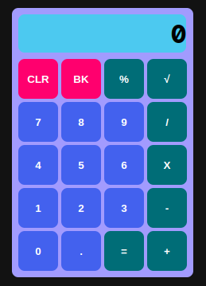

# The Odin Project

# Calculator

## On-screen calculator using JavaScript, HTML, and CSS

Live view: <https://arturopstem.github.io/calculator/>

### Chaining operators is available:

- `2 + 3 / 10 =`  
  yields `0.5`

- `12 + 7 - 5 * 3 =`  
  yields `42`

### Keyboard shortcuts

In addition to the keys for basic math operators ( / \* - + ), numbers 0 to 9 and the dot, the following are available:

- `Esc` &emsp;&emsp; : CLR
- `Backspace` or `Delete` : BK
- `%` &emsp;&emsp;&emsp; : %
- `R` or `r` &emsp; : &#8730;
- `Enter` &emsp; : =

### Percentage

- `5 * 30 %` &emsp; means 30% of 5 and yields `1.5`
- `5 + 30 %` &emsp; means 5 plus 30% of 5 and yields `6.5`
- `5 - 30 %` &emsp; means 5 minus 30% of 5 and yields `3.5`
- `5 / 30 %` &emsp; means 5 divided by 30/100 and yields `16.666`
